# Five-Stop Elevator Automation — Siemens TIA Portal + SIMATIC Safety


This repository documents the Siemens TIA Portal V20 version of my five-stop elevator controller. The elevator logic is intentionally more than a simple Up/Down demo: it retains direction-aware request handling, separates service direction from physical motion, isolates control from simulation, gives each stateful subsystem one owner, and adds a separate S7-1500F fail-safe permission layer before the final motion outputs.

The key design rule is simple: **the standard program decides where the elevator should go; the F-program decides whether motion is allowed.** The two paths meet once, at the final output arbitration layer.

<p align="center">
  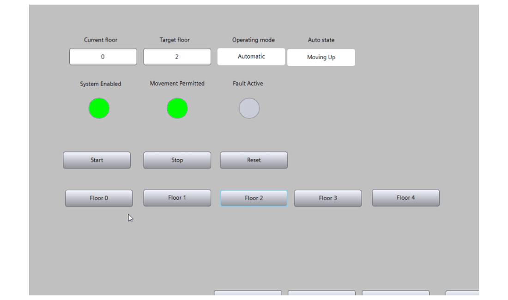
</p>

<p align="center"><strong>WinCC / PLCSIM sequence preview</strong></p>

<!-- GITHUB INLINE VIDEO: edit this README on github.com and drag Elevator_Automatic_Safety_Demo.mp4 directly below this comment. -->
<p align="center"><strong>Full automatic-cycle demonstration</strong></p>

https://github.com/user-attachments/assets/c0e6d334-c111-4895-a2c8-e18fef086c7b


**Engineering stack:** `TIA Portal V20` · `CPU 1511F-1 PN` · `SIMATIC Safety` · `WinCC Unified` · `SCL/LAD/FBD` · `UDT/DB architecture` · `ET 200SP F-I/O` · `PROFINET` · `PROFIsafe` · `PLCSIM` · `structured FAT`

**Quick access:** [FAT report](docs/Elevator_FAT_Validation_Report.pdf) · [Architecture](docs/ARCHITECTURE.md) · [Safety architecture](docs/SAFETY_ARCHITECTURE.md) · [Block reference](docs/PLC_BLOCK_REFERENCE.md) · [Source excerpts](plc-excerpts/README.md) · [Traceability](docs/ENGINEERING_TRACEABILITY.md) · [PLCSIM guide](docs/RUNNING_IN_PLCSIM.md) · [TIA archive / Releases](https://github.com/mohammadHamdan96-Eng/Elevator-TIA-Safety/releases/latest)

**Jump to:** [Engineering snapshot](#engineering-snapshot) · [CODESYS → TIA redesign](#1-from-codesys-baseline-to-tia-portal-architecture) · [PLC architecture](#2-plc-architecture-and-single-writer-ownership) · [Sequence and dispatch](#3-automatic-sequence-request-handling-and-maintenance) · [Safety](#4-simatic-safety-and-final-motion-permission) · [HMI and diagnostics](#5-wincc-unified-operation-and-diagnostics) · [FAT](#6-fat-validation-and-recovery-behaviour) · [Archive](#7-project-archive-and-reproduction)

---

## Engineering snapshot

| Area | Implemented scope |
|---|---|
| Elevator | 5 stops, car calls, directional hall calls, automatic target selection |
| Standard control | Auto sequence, call storage, dispatcher, maintenance, alarms, final output arbitration |
| Data model | Structured UDTs, `DB_HMI`, `DB_IO`, `DB_Config`, `DB_System`, controller/simulation instance DBs |
| Ownership | Separate owners for calls, mode, Auto state, Maintenance state, feedback, alarms and `FinalCmd` |
| Simulation | Dedicated elevator simulation owns floor/door/drive feedback and fault injection |
| HMI | Overview, hall calls, maintenance, diagnostics and alarm/status interfaces |
| Safety controller | CPU 1511F-1 PN with SIMATIC Safety F-runtime group |
| F-I/O | ET 200SP fail-safe I/O architecture with PROFIsafe parameterization |
| Fail-safe permission | E-stop release + door release → `F_SafeMotionEnable` |
| Final gate | Standard movement request + normal permissives + `F_SafeMotionEnable` |
| Validation | 7 screenshot-backed PLCSIM FAT tests |

### Control path and safety boundary

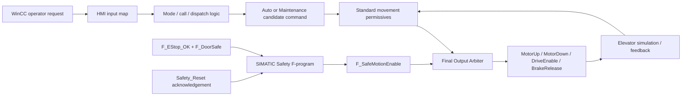
```mermaid
flowchart LR
    HMI[WinCC operator request] --> INPUT[HMI input map]
    INPUT --> MODE[Mode / call / dispatch logic]
    MODE --> AUTO[Auto or Maintenance candidate command]
    AUTO --> STD[Standard movement permissives]

    FDI[F_EStop_OK + F_DoorSafe] --> FPROG[SIMATIC Safety F-program]
    RESET[Safety_Reset acknowledgement] --> FPROG
    FPROG --> SAFE[F_SafeMotionEnable]

    STD --> ARB[Final Output Arbiter]
    SAFE --> ARB
    ARB --> OUT[MotorUp / MotorDown / DriveEnable / BrakeRelease]

    OUT --> SIM[Elevator simulation / feedback]
    SIM --> STD
```

The F-program does **not** select destination or direction. It provides one independent permission that is checked in the final movement path.

<p align="center">
  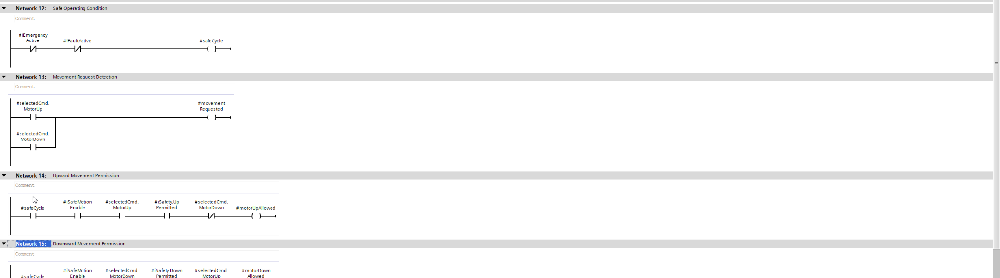
</p>

> **Safety scope:** this repository shows a portfolio/lab implementation of SIMATIC Safety concepts and PLCSIM validation. It is not a certified passenger-elevator safety design, SIL claim, conformity assessment, or physical commissioning record.

---

## 1. From CODESYS baseline to TIA Portal architecture

The TIA version was redesigned rather than translated network-for-network. The original CODESYS controller already provided the core elevator behaviour; the Siemens version focuses on removing ownership ambiguity, separating commands from feedback, making the plant model independent from the controller, and introducing a separate fail-safe permission boundary implemented in SIMATIC Safety.

| CODESYS baseline issue / limitation | TIA Portal implementation |
|---|---|
| Shared sequence variable written by several responsibilities | Separate `AutoState`, `MaintenanceState` and `OperatingMode` owners |
| Service intent and physical travel shared one direction variable | Separate **Service Direction** and **Motion Direction** |
| Repeated floor-specific request logic | Array-based call structures and bounded request-manager logic |
| Continuous button level could recreate a served call | Rising-edge call capture in the Call Manager |
| Commands could be confused with physical proof | Independent `UDT_PlantFeedback` and `UDT_ActuatorCommand` paths |
| Automatic and Maintenance logic could compete for outputs | Candidate commands + one `FC_OutputArbiter` final writer |
| Simulation and controller behaviour were coupled | Dedicated `FB_ElevatorSimulation` owns simulated feedback |
| Door-interlock diagnostic was weakened by feedback coupling | Door Closed / Door Locked feedback used explicitly for movement and alarms |
| Standard control only | S7-1500F + SIMATIC Safety + fail-safe motion permission |
| Functional checks were informal | Structured 7-case screenshot-backed FAT report |

The migration therefore preserves the elevator behaviour while changing the controller structure around it.

### One regression that drove the redesign

A held floor button could previously recreate the same request immediately after the served call was cleared. In the TIA design, call capture uses edge memory, so a still-high button is not treated as a new event. The normal post-service path becomes:

```text
Door open → dwell → close/lock → served event → idle
      80      81        82             90        10
```

That is a small implementation detail, but it shows why event ownership and edge handling matter in a cyclic PLC program.

### Representative SCL — edge-triggered call capture

`FB_CallManager` calculates new button edges **before** updating the previous-state memories. Stored calls remain owned by the Call Manager; a served-call clear is applied through the same ownership path before new edge events are stored.

The excerpt below is transcribed from the retained TIA Portal implementation view shown in the evidence section; it is not presented as a complete native block export.

```scl
// Calculate edges before updating the previous-state memories.
FOR #idx := 0 TO 4 DO
    #tmpCarEdge[#idx] :=
        #iCommand.CarButton[#idx] AND NOT #stCarOld[#idx];
END_FOR;

FOR #idx := 0 TO 3 DO
    #tmpHallUpEdge[#idx] :=
        #iCommand.HallUpButton[#idx] AND NOT #stHallUpOld[#idx];
END_FOR;

FOR #idx := 1 TO 4 DO
    #tmpHallDownEdge[#idx] :=
        #iCommand.HallDownButton[#idx] AND NOT #stHallDownOld[#idx];
END_FOR;
```

After processing the scan, the previous-button memories are updated even while passenger calls are disabled. A button held through Maintenance therefore cannot become a false new rising edge when Auto is enabled again.

```scl
// Always update edge memories, even while calls are disabled. A button
// held during Maintenance therefore cannot become a false new edge.
FOR #idx := 0 TO 4 DO
    #stCarOld[#idx] := #iCommand.CarButton[#idx];
END_FOR;

FOR #idx := 0 TO 3 DO
    #stHallUpOld[#idx] := #iCommand.HallUpButton[#idx];
END_FOR;
```

[Open the browser-readable Call Manager excerpts](plc-excerpts/README.md)

<details>
<summary><strong>TIA Portal implementation evidence — Call Manager</strong></summary>

<p align="center">
  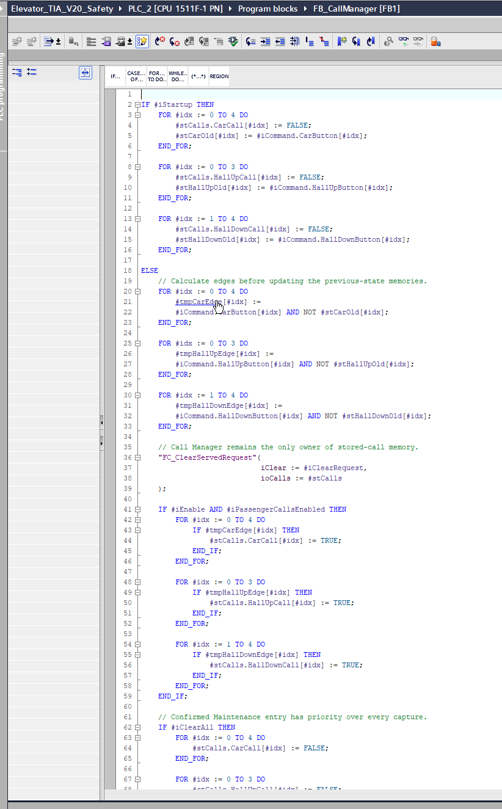
</p>

<p align="center">
  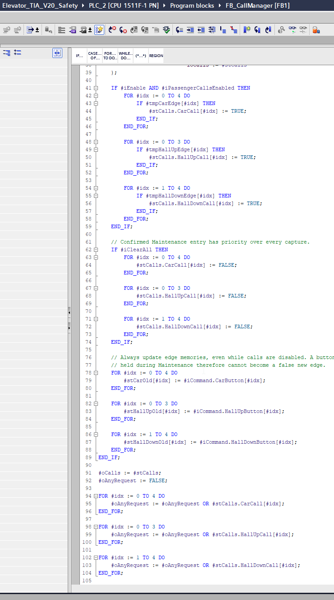
</p>

</details>

**Baseline repository:** [Five-Floor Elevator — original CODESYS implementation](https://github.com/mohammadHamdan96-Eng/FiveFloor-Elevator-CODESYS)

---

## 2. PLC architecture and single-writer ownership

The software is split around responsibilities rather than around individual HMI buttons or floors.

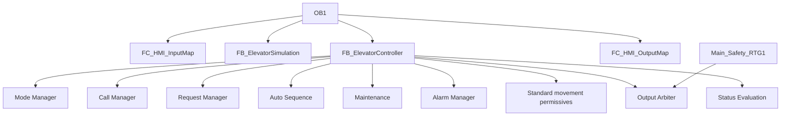
```mermaid
flowchart TD
    OB1[OB1] --> IN[FC_HMI_InputMap]
    OB1 --> SIM[FB_ElevatorSimulation]
    OB1 --> CTRL[FB_ElevatorController]
    OB1 --> OUTMAP[FC_HMI_OutputMap]

    CTRL --> MODE[Mode Manager]
    CTRL --> CALL[Call Manager]
    CTRL --> REQ[Request Manager]
    CTRL --> AUTO[Auto Sequence]
    CTRL --> MAINT[Maintenance]
    CTRL --> ALARM[Alarm Manager]
    CTRL --> SAFEVAL[Standard movement permissives]
    CTRL --> ARB[Output Arbiter]
    CTRL --> STATUS[Status Evaluation]

    FPROG[Main_Safety_RTG1] --> ARB
```

### Global DB boundaries

| DB | Responsibility |
|---|---|
| `DB_HMI` | stable WinCC `Command` / `Status` contract |
| `DB_IO` | logical plant boundary: `Feedback` + `FinalCmd` |
| `DB_Config` | named timing/configuration values |
| `DB_System` | startup request, simulation enable, normalized operator command, controller status |
| `DB_ElevatorController` | instance DB for the central controller |
| `DB_ElevatorSimulation` | instance DB for the simulation block |

The controller sub-FBs are implemented as **multi-instances inside `FB_ElevatorController`**, so Mode Manager, Call Manager, Auto Sequence, Maintenance and Alarm Manager retain local state without a separate global instance DB for every sub-block.

<details>
<summary><strong>Controller coordination and served-call handoff</strong></summary>

The coordinator calls the stateless Request Manager, then Auto Sequence, and deliberately delays the served-call event by one scan before Call Manager consumes it. This keeps stored-call memory under one writer instead of allowing Auto Sequence to clear call storage directly.

<p align="center">
  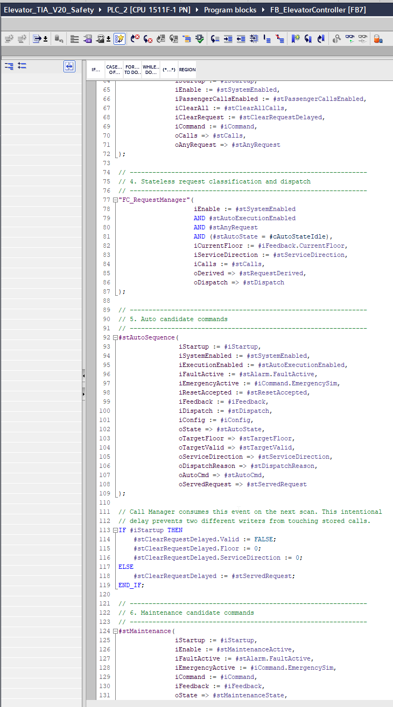
</p>

</details>

### Single-writer model

| Data | Sole normal owner |
|---|---|
| Stored passenger calls | Call Manager |
| Operating mode | Mode Manager |
| Auto state, target, service direction, Auto candidate command | Auto Sequence |
| Maintenance state and Maintenance candidate command | Maintenance |
| Simulated floor and physical feedback | Elevator Simulation |
| Raw / latched alarms | Alarm Manager |
| Final actuator command | Output Arbiter |
| WinCC status structure | HMI Output Map |

This prevents the common PLC failure mode where several blocks write the same state or output and the final value depends on scan order.

### Plant boundary

`DB_IO.Feedback` contains independent plant feedback such as:

- Current Floor / At Floor / Position Valid
- Door Open / Door Closed / Door Locked
- Motor Running / Motion Direction
- Drive Ready / Brake Released
- Top and Bottom limits
- standard safety-chain status used by the standard controller

`DB_IO.FinalCmd` contains the final command layer:

- Motor Up / Motor Down
- Door Open / Door Close / Door Lock
- Drive Enable
- Brake Release

The controller makes decisions from feedback. Commands are never treated as proof that the plant has reached the requested state.

### Standard movement permissives

Before the fail-safe permission is applied at the final gate, the standard controller independently evaluates door proof, drive readiness, valid floor/limits and contradictory direction requests. This keeps normal process permissives separate from the F-program.

> **Naming note:** `FC_SafetyEvaluation` is a **standard/non-F control block** despite its name. It evaluates normal movement permissives. The independent fail-safe permission is produced separately by `Main_Safety_RTG1` and enters the final command path as `F_SafeMotionEnable`.

<p align="center">
  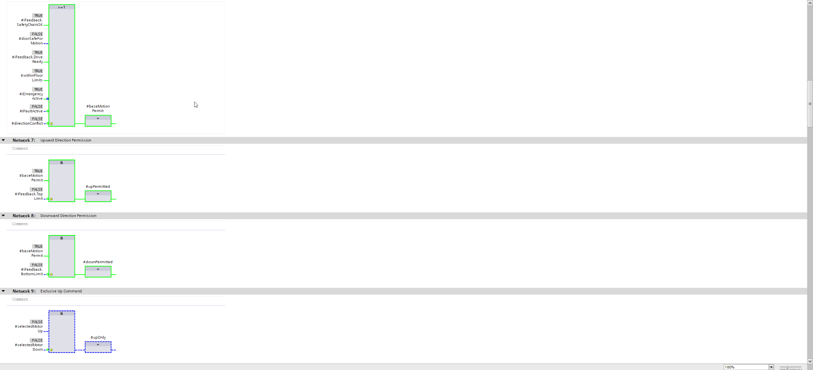
</p>

<details>
<summary><strong>Implementation references</strong></summary>

<p align="center">
  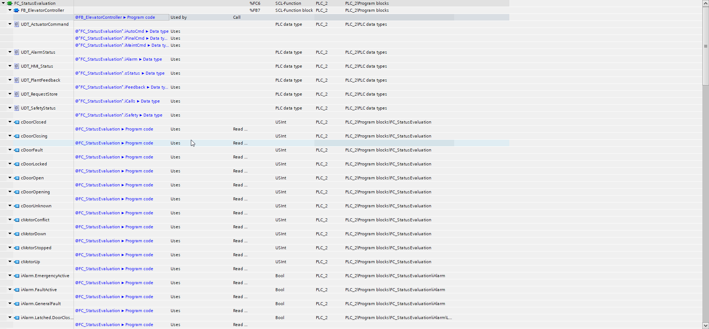
</p>

<p align="center">
  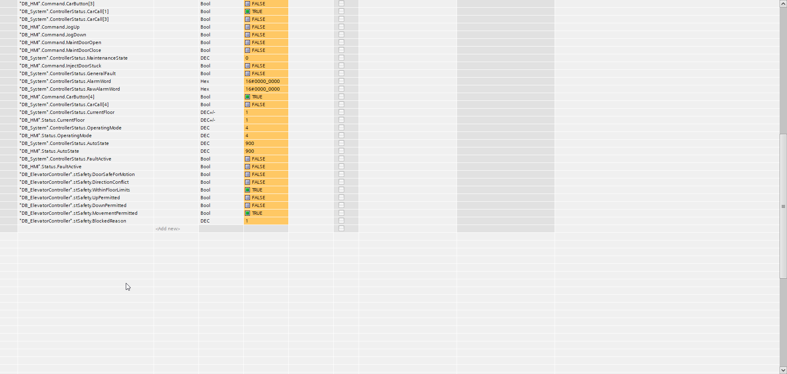
</p>

<p align="center">
  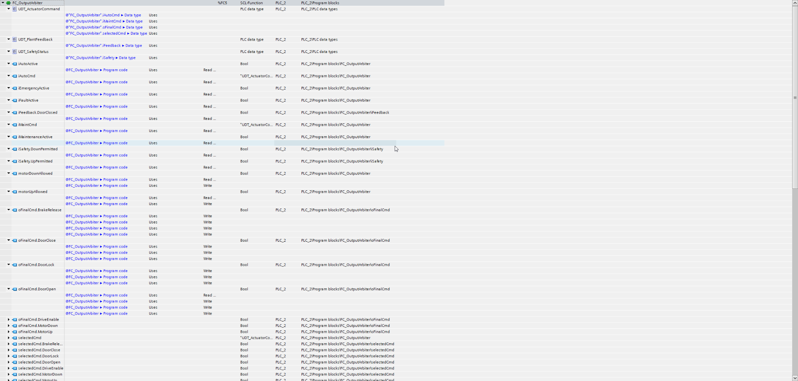
</p>

<p align="center">
  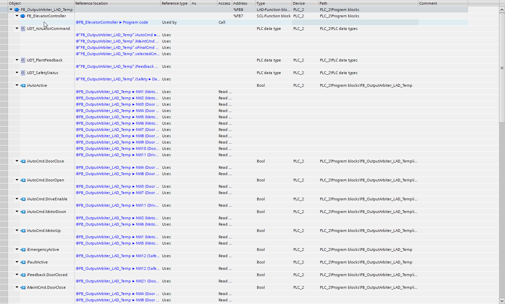
</p>

</details>

---

## 3. Automatic sequence, request handling and maintenance

### Automatic state machine

| State | Function |
|---:|---|
| `0` | Off |
| `10` | Idle |
| `20` | Evaluate target |
| `30` | Close door |
| `40` | Direction decision |
| `50` | Move Up |
| `60` | Move Down |
| `70` | Arrival |
| `80` | Door open |
| `81` | Door dwell |
| `82` | Close / lock after service |
| `90` | Issue served-call event |
| `900` | Fault / emergency |

The sequence is feedback-driven. It does not write `CurrentFloor`; movement changes only after the simulation produces new floor feedback. Door locking is requested only after Door Closed is proven, and movement requires both Door Closed and Door Locked.

### Direction-aware request handling

The request manager does more than choose the numerically closest floor. It keeps **Service Direction** separate from the actual **Motion Direction**, which allows the controller to reposition while preserving the direction of the accepted service journey.

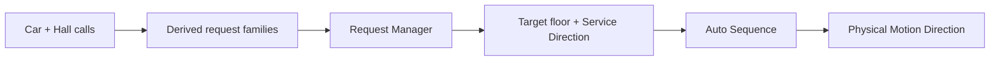
```mermaid
flowchart LR
    CALLS[Car + Hall calls] --> DERIVE[Derived request families]
    DERIVE --> DISPATCH[Request Manager]
    DISPATCH --> TARGET[Target floor + Service Direction]
    TARGET --> AUTO[Auto Sequence]
    AUTO --> MOTION[Physical Motion Direction]
```

The design stores 13 valid passenger-call bits:

- 5 car calls
- Hall Up F0…F3
- Hall Down F1…F4

Invalid terminal-direction calls are not treated as normal requests.

<p align="center">
  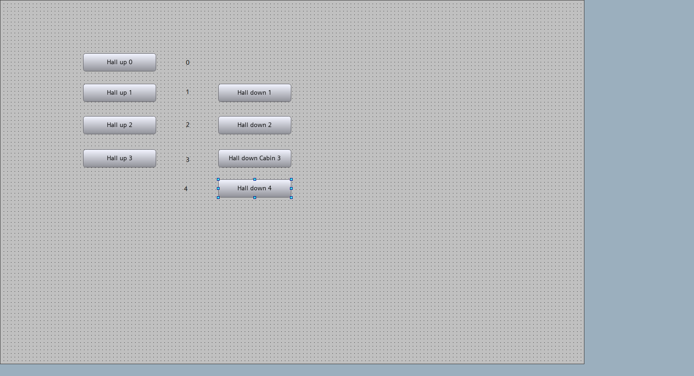
</p>

### Maintenance mode

Maintenance uses its own state owner and candidate command path.

| State | Function |
|---:|---|
| `800` | Maintenance idle |
| `810` | Hold-to-run Jog Up |
| `820` | Hold-to-run Jog Down |
| `830` | Maintenance Door Open |
| `840` | Maintenance Door Closing / Locking |

Key rules:

- passenger calls are blocked when Maintenance is requested;
- accepted Auto travel is not arbitrarily interrupted during a mode transition;
- JogUp / JogDown are hold-to-run;
- releasing the jog removes motor, drive-enable and brake-release commands;
- opposing jog commands cannot create contradictory motion;
- terminal limits remain active;
- Emergency / fault gating remains active.

<p align="center">
  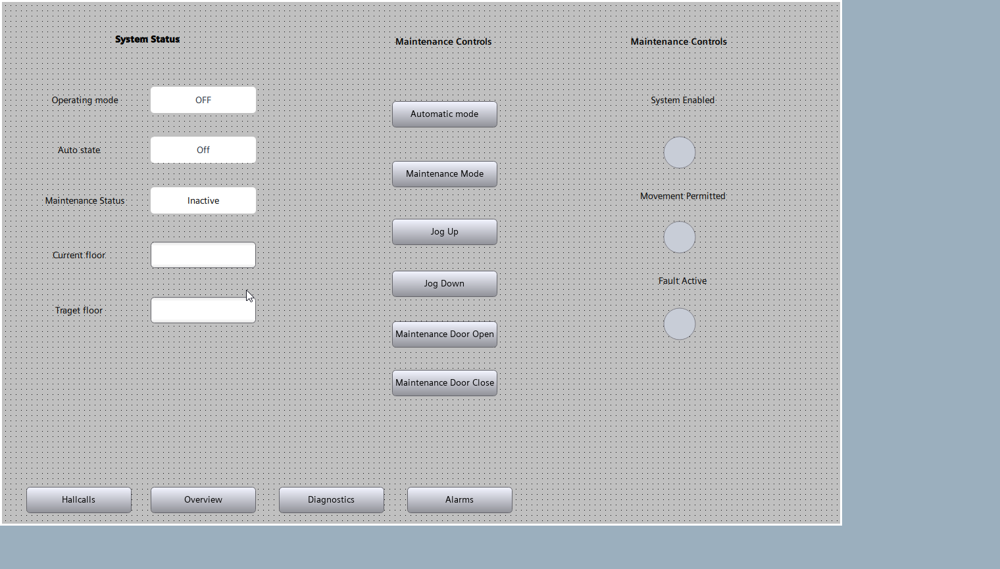
</p>

The FAT package contains positive JogUp and JogDown evidence and verifies that releasing the command returns the Maintenance state to its idle condition with motion removed.

---

## 4. SIMATIC Safety and final motion permission

The integrated safety project uses a **CPU 1511F-1 PN**, SIMATIC Safety, an F-runtime group and ET 200SP fail-safe I/O / PROFIsafe configuration.

<p align="center">
  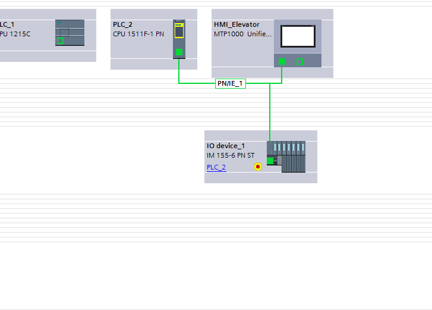
</p>

The safety path documented here is implemented on **PLC_2 / CPU 1511F-1 PN**. `PLC_1` is a separate standard CPU station retained in the engineering project and is not the F-program controller described in this section.

### F-runtime group

The retained configuration shows:

- F-runtime group: `RTG1`
- F-OB: `FOB_RTG1 [OB123]`
- main safety block: `Main_Safety_RTG1 [FB8]`
- runtime cycle: **100 ms**
- warning threshold: **110 ms**
- maximum cycle: **120 ms**

<p align="center">
  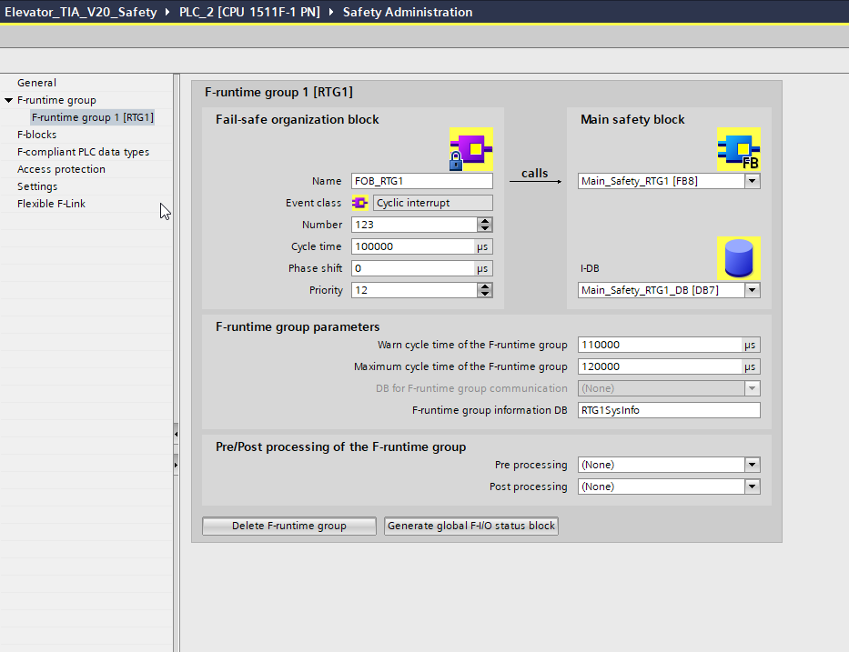
</p>

### E-stop / door-safe acknowledgement chain

The F-program implements a deliberately separate permission path:

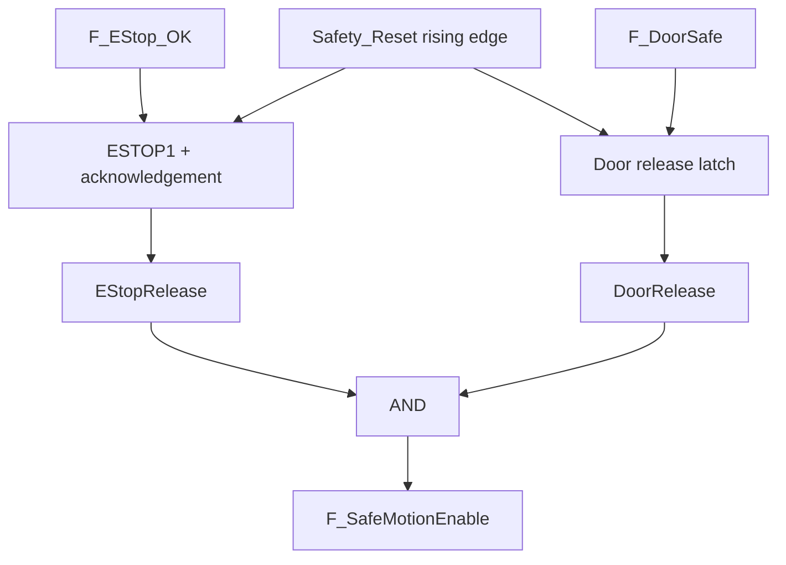
```mermaid
flowchart TD
    ESTOP[F_EStop_OK] --> EVAL[ESTOP1 + acknowledgement]
    RESET[Safety_Reset rising edge] --> EVAL
    EVAL --> ER[EStopRelease]

    DOOR[F_DoorSafe] --> DL[Door release latch]
    RESET --> DL
    DL --> DR[DoorRelease]

    ER --> AND[AND]
    DR --> AND
    AND --> SAFE[F_SafeMotionEnable]
```

- `F_EStop_OK` is evaluated by the fail-safe E-stop block with acknowledgement required.
- `Safety_Reset` is edge-detected for acknowledgement.
- `DoorRelease` is restored only after the safe door input and acknowledgement condition are satisfied.
- loss of `F_DoorSafe` removes the door release.
- `F_SafeMotionEnable` is the AND of the acknowledged E-stop and door releases.

<p align="center">
  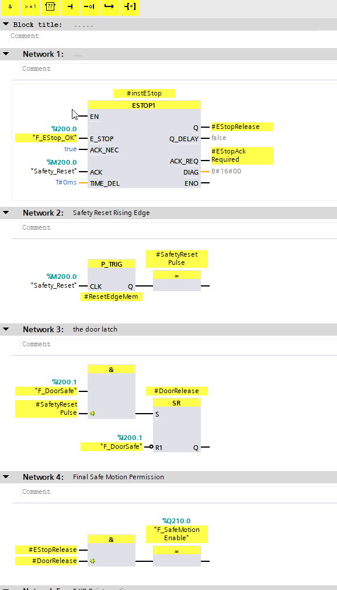
</p>

<details>
<summary><strong>Full retained F-program / final-gate implementation views</strong></summary>

<p align="center">
  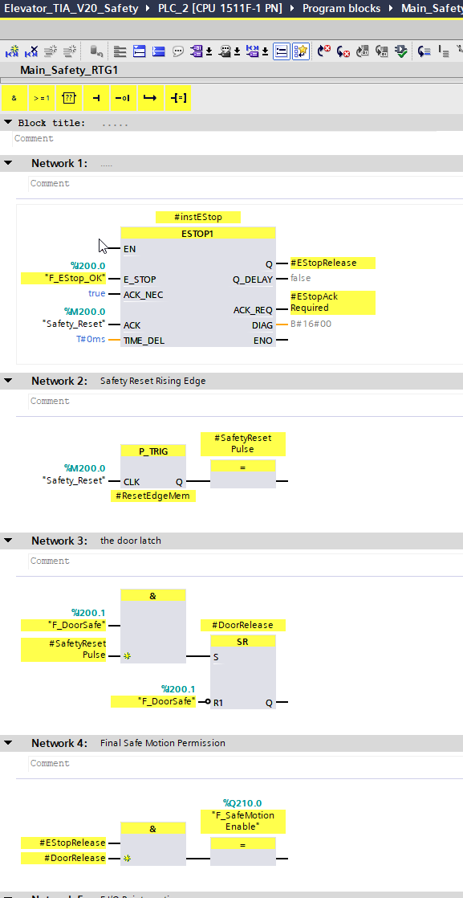
</p>

<p align="center">
  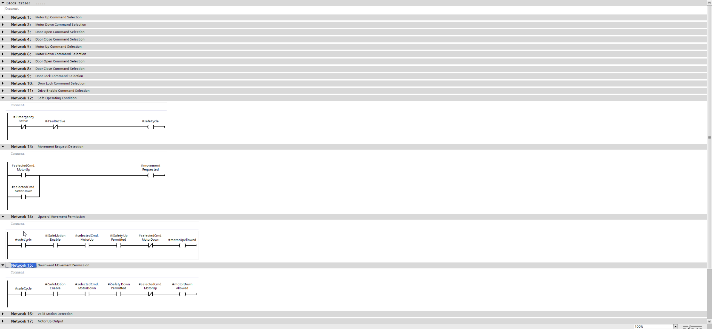
</p>

</details>

### Positive release in PLCSIM

For a healthy simulation, the F-input conditions are placed into the healthy state and then deliberately acknowledged:

```text
F_EStop_OK = TRUE
F_DoorSafe = TRUE
Safety_Reset: FALSE → TRUE → FALSE

Expected release:
EStopRelease       = TRUE
DoorRelease        = TRUE
F_SafeMotionEnable = TRUE
```

<p align="center">
  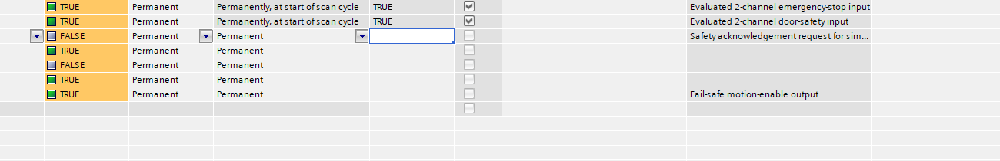
</p>

This is **PLCSIM test initialization**, not a recommendation for bypassing physical safety hardware.

### Final motion gate

The critical integration point is the Output Arbiter. Standard logic may request movement, but the final motion path additionally requires the fail-safe release.

### Representative SCL — standard/F-program boundary

The controller first evaluates the **standard** movement-permissive structure, then calls the single final-command writer. `iSafeMotionEnable` enters that arbiter as a separate input; it is not derived from the Auto or Maintenance command structures.

The excerpt below is transcribed from the retained TIA Portal implementation view immediately below it; it is not presented as a complete native block export.

```scl
"FC_SafetyEvaluation"(
    iEmergencyActive   := #iCommand.EmergencySim,
    iFaultActive       := #stAlarm.FaultActive,
    iMaintenanceActive := #stMaintenanceActive,
    iFeedback          := #iFeedback,
    iAutoCmd           := #stAutoCmd,
    iMaintCmd          := #stMaintCmd,
    oSafety            => #stSafety
);

"FC_OutputArbiter"(
    iAutoActive        := #stAutoExecutionEnabled,
    iMaintenanceActive := #stMaintenanceActive,
    iEmergencyActive   := #iCommand.EmergencySim,
    iFaultActive       := #stAlarm.FaultActive,
    iFeedback          := #iFeedback,
    iSafety            := #stSafety,
    iSafeMotionEnable  := #iSafeMotionEnable,
    iAutoCmd           := #stAutoCmd,
    iMaintCmd          := #stMaintCmd,
    oFinalCmd          => #stFinalCmd
);
```

[Open the browser-readable controller boundary excerpt](plc-excerpts/FB_ElevatorController_safety_arbiter_boundary_excerpt.scl)

<p align="center">
  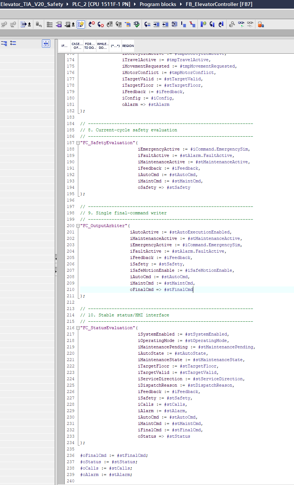
</p>

```text
standard movement request
        AND
standard direction / door / drive permissives
        AND
F_SafeMotionEnable
        ↓
FinalCmd.MotorUp / MotorDown / DriveEnable / BrakeRelease
```

FAT-07 checks the negative case directly: the standard controller is in a movement state with a target that requires travel, while `F_SafeMotionEnable = FALSE`; all final motion outputs remain FALSE.

### F-I/O / PROFIsafe

The project contains ET 200SP fail-safe I/O architecture and PROFIsafe parameterization. F-I/O reintegration is tied to the acknowledgement path rather than silently returning questionable field data into operation.

<p align="center">
  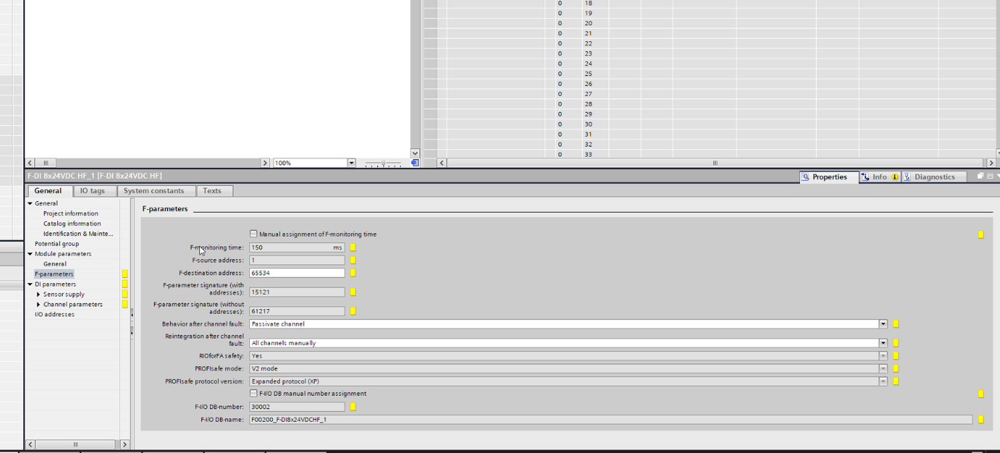
</p>

---

## 5. WinCC Unified operation and diagnostics

The HMI is not only a Start/Stop screen. It exposes controller status, movement permission, calls, maintenance actions and troubleshooting information through a stable `DB_HMI` interface rather than binding directly to internal controller instance data.

### Automatic travel

During the retained F0 → F2 test, the HMI shows:

- current floor `0`;
- target floor `2`;
- Automatic mode;
- Auto state **Moving Up**;
- System Enabled TRUE;
- Movement Permitted TRUE;
- no active fault.

<p align="center">
  
</p>

At the destination, Current Floor equals Target Floor, motion is removed and the controller returns to a non-motion state.

<p align="center">
  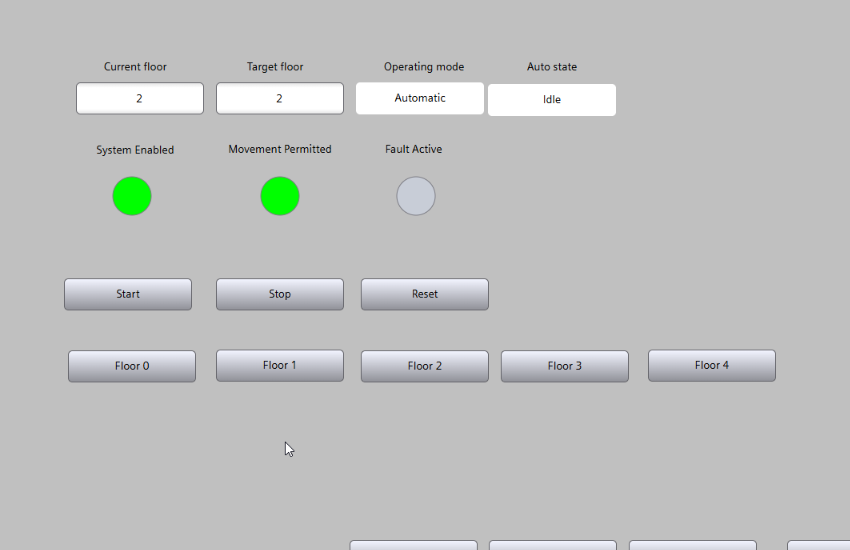
</p>

### Diagnostics

The diagnostic screen exposes the feedback conditions that explain whether motion is permitted:

- Door State
- Motor State
- Movement Blocked By
- At Floor
- Door Open / Closed / Locked
- Drive Ready
- Motor Running
- Top / Bottom limit

<p align="center">
  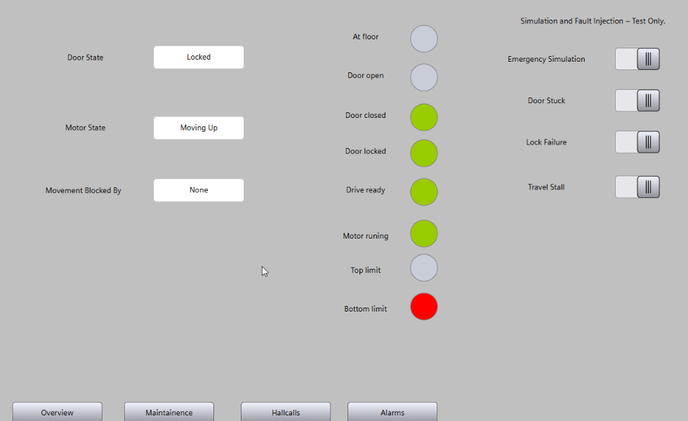
</p>

This is more useful during troubleshooting than a generic green/red status lamp because the same feedback signals are used by the controller's movement logic.

---

## 6. FAT validation and recovery behaviour

Seven defined tests were executed and retained in the public FAT report.

| FAT | Test | Main proof |
|---|---|---|
| FAT-01 | Normal travel | valid request → upward motion → clean arrival |
| FAT-02 | Multi-call sequence | coherent target/state progression and final output removal |
| FAT-03 | Door interlock | movement inhibited during the tested unsafe/interlocked condition |
| FAT-04 | Door-stuck fault / recovery | state `900`, alarm word `16#0000_0002`, outputs off, deliberate recovery |
| FAT-05 | Maintenance jog | states `810` / `820`, hold-to-run Up and Down behaviour |
| FAT-06 | Stop / restart | STOP removes final commands; later deliberate Start restores valid travel |
| FAT-07 | Safety integration | standard movement requested while `F_SafeMotionEnable = FALSE` → final motion stays off |

**[Open the screenshot-rich FAT Validation Report](docs/Elevator_FAT_Validation_Report.pdf)**

The report is intentionally evidence-oriented: each test page states the check, observed result and retained PLC/HMI screenshots rather than only marking PASS.

### Door-stuck recovery

The door-stuck test exercises the normal controller's fault path:

```text
Injected door-stuck condition
        ↓
AutoState 900
AlarmWord 16#0000_0002
GeneralFault / FaultActive
        ↓
Final motion outputs removed
        ↓
Cause cleared + Reset
        ↓
Deliberate Start required
        ↓
Travel resumes
```

The restart is deliberate. Clearing or resetting a fault does not silently continue motion from the previous state.

### Stop behaviour

During FAT-06, STOP removes the active motion command and returns the controller to Off / disabled conditions. A new Start is required before motion returns.

### Safety-integration boundary

FAT-07 is the most important integration check because it verifies the boundary between the two programs rather than only checking the F-program in isolation.

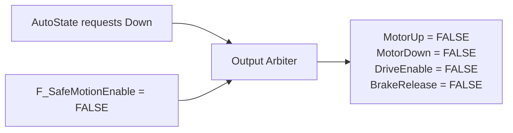
```mermaid
flowchart LR
    STD[AutoState requests Down] --> ARB[Output Arbiter]
    SAFE[F_SafeMotionEnable = FALSE] --> ARB
    ARB --> OFF["MotorUp = FALSE<br/>MotorDown = FALSE<br/>DriveEnable = FALSE<br/>BrakeRelease = FALSE"]
```

See [`docs/ENGINEERING_TRACEABILITY.md`](docs/ENGINEERING_TRACEABILITY.md) for the signal-to-block-to-FAT mapping.

---

## 7. Project archive and reproduction

The large TIA Portal archive is distributed through **GitHub Releases** instead of normal Git history.

**[Open the latest release / TIA Portal archive](https://github.com/mohammadHamdan96-Eng/Elevator-TIA-Safety/releases/latest)**

Archive filename:

```text
Elevator_TIA_V20_Safety_FINAL_2026-08-29.zap20
```

Release tag:

```text
v1.0.0
```

The repository contains a dedicated PLCSIM reproduction guide:

**[RUNNING_IN_PLCSIM.md](docs/RUNNING_IN_PLCSIM.md)**

A fresh simulation requires the fail-safe input conditions to be established in a healthy simulated state and acknowledged before `F_SafeMotionEnable` becomes TRUE. That procedure is documented as a simulation prerequisite, not as physical safety bypass logic.

<details>
<summary><strong>Repository map</strong></summary>

```text
Elevator-TIA-Safety/
├── README.md
├── docs/
│   ├── ARCHITECTURE.md
│   ├── SAFETY_ARCHITECTURE.md
│   ├── PLC_BLOCK_REFERENCE.md
│   ├── ENGINEERING_TRACEABILITY.md
│   ├── FAT_VALIDATION.md
│   ├── RUNNING_IN_PLCSIM.md
│   ├── ENGINEERING_SCOPE.md
│   ├── RELEASE_NOTES_TEMPLATE.md
│   └── Elevator_FAT_Validation_Report.pdf
├── media/
│   ├── preview/
│   ├── architecture/
│   ├── safety/
│   ├── hmi/
│   ├── engineering/
│   ├── video/
│   └── social-preview.png
├── plc-excerpts/
│   ├── FB_CallManager_edge_capture_excerpt.scl
│   ├── FB_CallManager_edge_memory_excerpt.scl
│   ├── FB_ElevatorController_safety_arbiter_boundary_excerpt.scl
│   └── README.md
└── project/
    └── README.md
```

</details>

---

## Engineering scope

This project demonstrates:

- Siemens TIA Portal V20 project structure;
- five-stop elevator sequence and direction-aware request handling;
- structured UDT / DB architecture and single-writer ownership;
- independent command and feedback models;
- Auto / Maintenance candidate commands with one final arbiter;
- WinCC Unified operator and diagnostics screens;
- CPU 1511F-1 PN / SIMATIC Safety architecture;
- F-runtime group configuration;
- ET 200SP F-I/O / PROFIsafe parameterization;
- acknowledgement / restart behaviour;
- fail-safe motion permission integrated into the final motion path;
- structured PLCSIM FAT and recovery testing.

It does **not** claim a certified passenger-elevator controller, a validated SIL/PL safety function, physical lift commissioning, TÜV approval, or compliance assessment for a real installation.

---

## Related work

- [Five-Floor Elevator — CODESYS baseline](https://github.com/mohammadHamdan96-Eng/FiveFloor-Elevator-CODESYS) original process-control baseline before the TIA redesign
- [ThreeTank — Siemens TIA Portal process automation](https://github.com/mohammadHamdan96-Eng/ThreeTank-TIA-Automation)
  

## Author

**Mohammad Hamdan**  
Mechatronics Engineer · PLC / Automation Engineering  
[GitHub profile](https://github.com/mohammadHamdan96-Eng)
