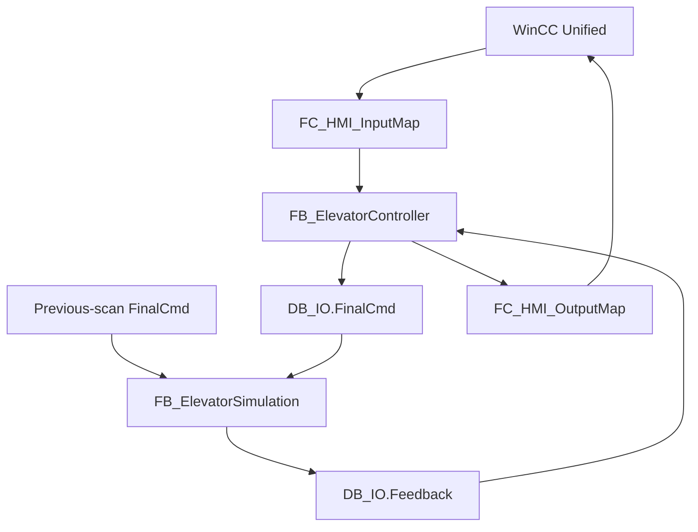

# Elevator control architecture

This document expands the software architecture summarized in the repository README. The central design goal is to keep **request handling, sequence ownership, plant feedback, final actuator commands and fail-safe motion permission separate** so that each decision can be traced to one owner.

## 1. Main execution path



The simulation consumes the previous scan's final command and is the only normal writer of simulated plant feedback. The controller reads that feedback and generates the next final command.

## 2. Controller decomposition

`FB_ElevatorController` is the central application coordinator. Its stateful sub-functions are implemented as multi-instances where applicable.

| Function | Responsibility |
|---|---|
| Mode Manager | accepted operating mode, Maintenance pending/active, call permission |
| Call Manager | sole owner of stored car and hall calls; rising-edge capture |
| Request Manager | direction-aware target recommendation; no retained target state |
| Auto Sequence | accepted target, Auto state, service direction, Auto candidate command |
| Maintenance | Maintenance state and hold-to-run candidate command |
| Alarm Manager | raw causes, latched alarms, timeout supervision, fault summary |
| Standard movement-permissive evaluation | standard door/drive/limit/conflict permissives and blocked reason |
| Output Arbiter | sole normal writer of `FinalCmd` |
| Status Evaluation | stable operating/diagnostic status for WinCC |

The integrated fail-safe program remains separate from this standard-control decomposition. It contributes the independent `F_SafeMotionEnable` permission at the final motion boundary.

## 3. OB1 order

The standard application uses a deliberate scan order:

1. `FC_HMI_InputMap`
2. `FB_ElevatorSimulation` / `DB_ElevatorSimulation`
3. `FB_ElevatorController` / `DB_ElevatorController`
4. `FC_HMI_OutputMap`
5. clear the one-scan startup request

This ordering preserves one writer for simulated feedback and makes the previous-scan command / current-scan feedback relationship explicit.

## 4. Data boundaries

### `DB_HMI`

`Command` is written by WinCC. `Status` is the stable read interface for WinCC. HMI screens do not need to bind to controller or simulation instance-DB internals.

### `DB_IO`

`Feedback` is the logical plant-input side and contains independent feedback such as current floor, door proof, drive readiness and limits.

`FinalCmd` is the final actuator-command side and contains Motor Up/Down, Door Open/Close/Lock, Drive Enable and Brake Release.

### `DB_Config`

Contains named timing/configuration values rather than scattering magic timer constants through the control logic.

### `DB_System`

Contains startup/simulation state, normalized operator command and the stable controller-status model.

## 5. Single-writer ownership

| Data | Sole normal owner |
|---|---|
| Stored passenger calls | Call Manager |
| Operating mode | Mode Manager |
| Auto state / target / service direction / Auto candidate command | Auto Sequence |
| Maintenance state / Maintenance candidate command | Maintenance |
| Simulated current floor and feedback | Elevator Simulation |
| Raw and latched alarms | Alarm Manager |
| Final actuator command | Output Arbiter |
| WinCC status | HMI Output Map |

The Request Manager returns a recommendation; it does not retain the accepted target. Auto and Maintenance create candidate commands; neither writes the final motion output directly.

## 6. Request / motion separation

The controller keeps **Service Direction** separate from **Motion Direction**.

- Service Direction describes the call-serving commitment.
- Motion Direction describes the current physical direction reported by the plant model.

This matters during repositioning: the car can physically move opposite to the service direction while positioning itself for the next compatible journey.

## 7. Command / feedback separation

Movement and door-state decisions use feedback, not command bits.

Examples:

- Door Close command is not proof of Door Closed.
- Door Lock command is not proof of Door Locked.
- Motor command is not proof of Motor Running.
- A target request does not write Current Floor.

The dedicated `FB_ElevatorSimulation` generates delayed feedback and supports Door Stuck, Lock Failure and Travel Stall fault injection.

## 8. Standard program vs fail-safe program

```text
STANDARD PROGRAM                         F-PROGRAM
----------------                         ---------
request / target                         F_EStop_OK
Auto or Maintenance                      F_DoorSafe
normal movement permissives              Safety_Reset acknowledgement
        |                                      |
        v                                      v
candidate motion                         F_SafeMotionEnable
        \                                      /
         \                                    /
          +-------- FC_OutputArbiter --------+
                         |
                         v
                     FinalCmd
```

The standard program decides **what motion is requested**. The fail-safe program decides **whether motion is permitted**. Direction selection is not delegated to the F-program.

## 9. Evidence

- [SIMATIC Safety architecture](SAFETY_ARCHITECTURE.md)
- [PLC block reference](PLC_BLOCK_REFERENCE.md)
- [Engineering traceability](ENGINEERING_TRACEABILITY.md)
- [FAT validation](FAT_VALIDATION.md)
- [PLCSIM reproduction guide](RUNNING_IN_PLCSIM.md)
